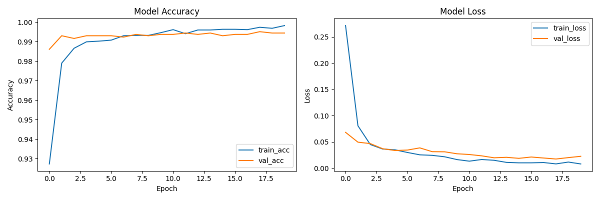
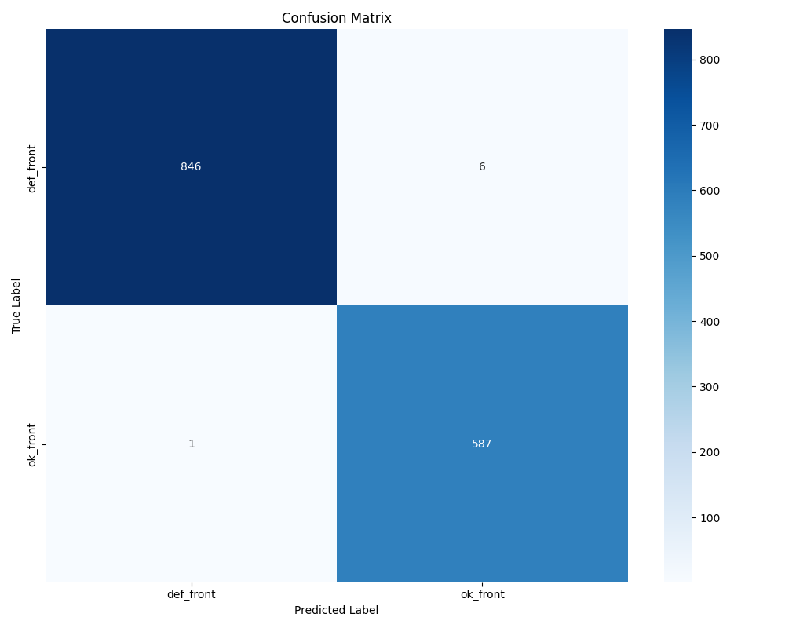

# Industrial Quality Control: Casting Defect Detection

A production-ready Deep Learning microservice for automated surface defect detection in metal casting. Built with **TensorFlow 2.x**, **FastAPI**, and **Docker**.

## 🚀 Overview
This project provides an end-to-end pipeline to identify manufacturing defects (cracks, flaws) using Computer Vision. It transforms a raw industrial dataset into a scalable REST API, ready for integration into factory monitoring systems.

### Key Features
- **Transfer Learning & Fine-tuning:** Two-stage training with EfficientNetV2-S for high accuracy.
- **Automated Data Pipeline:** Custom script to fetch and merge industrial datasets via `kagglehub`.
- **Production API:** FastAPI-based inference with Pydantic validation and async processing.
- **CI/CD Integration:** Automated testing and linting via GitHub Actions.
- **Dynamic Class Handling:** Automatically maps classes from the directory structure.

---

## 🛠 Tech Stack
- **AI/ML:** TensorFlow, Keras, Scikit-learn
- **Backend:** FastAPI, Uvicorn, Pydantic
- **DevOps:** Docker, Docker Compose, GitHub Actions
- **Analysis:** Matplotlib, Seaborn, Numpy

---

## 📊 Model Evaluation
We track performance metrics to ensure reliability in industrial environments.

<table border="0">
  <tr>
    <td>
      <p align="center"><b>Training Metrics (Accuracy & Loss)</b></p>
      
    </td>
    <td>
      <p align="center"><b>Confusion Matrix</b></p>
      
    </td>
  </tr>
</table>

### Performance Insights:
- **Convergence:** Minimal gap between training and validation loss, indicating no significant overfitting.
- **Reliability:** High precision across all industrial classes, confirmed by the Confusion Matrix.
- **Explainability:** Verification of model focus areas during the fine-tuning stage for optimal backbone performance.

---

## 📦 Project Structure
- `config.py`: Centralized hyperparameters and file paths.
- `model_factory.py`: Reusable model architecture logic.
- `train.py`: Training pipeline with auto-generation of `classes.txt` and plots.
- `main.py`: FastAPI production server.
- `download_data.py`: Automated script for industrial dataset ingestion.
- `test_main.py`: Integration tests for API and reports.
- `.github/workflows/`: CI/CD configuration.

---

## ⚡ Quick Start

### 1. Requirements
- Python 3.10+
- Docker & Docker Compose

### 2. Setup & Data Ingestion
```bash
# Clone the repository
git clone https://github.com/Filang666/AI-with-EfficientNetV2-S.git
cd AI-with-EfficientNetV2-S

# Install dependencies
pip install -r requirements.txt

# Download and prepare the Industrial Dataset
python download_data.py
```

### 3. Training
```bash

python train.py
```

### 4. Running with Docker (Recommended)
```bash

docker-compose up --build -d
```

### 5. Running with Uvicorn
```bash

uvicorn main:app --reload
```
Access the interactive API docs at <http://localhost:8000/docs>.

## 🧪 Testing
Run the automated test suite to ensure service stability:
```bash

pytest test_main.py
```

## 👤 Author
**Filang666**
GitHub: @Filang666
LinkedIn: 
